# Geki Pico - ONGEKI Style Mini Controller
[点这里可以切换到中文版](README_CN.md)

Features:
* It's small but closely replicates the feel of the arcade controller.
* Smooth lever action with adjustable resistance.
* Air WAD with sound feedback.
* IO4 emulation.
* Built-in AIME card reader.
* Command line for configurations.
* All source files open.

Thanks to many respectful guys/companies who made their tools or materials free or open source (KiCad, OnShape, InkScape, Raspberry things).

Special thanks to community projects and developers.

* Robin Grosset (https://github.com/rgrosset/pico-pwm-audio)
* GEEKiDoS (https://github.com/GEEKiDoS/ongeeki-firmware)
* Pololu (https://github.com/pololu/vl53l0x-arduino, https://github.com/pololu/vl53l1x-arduino)
* RP_Silicon_KiCad: https://github.com/HeadBoffin/RP_Silicon_KiCad
* Type-C: https://github.com/ai03-2725/Type-C.pretty

## My Other Projects
You can check out my other cool projects.

           

* Popn Pico: https://github.com/whowechina/popn_pico
* IIDX Pico: https://github.com/whowechina/iidx_pico
* IIDX Teeny: https://github.com/whowechina/iidx_teeny
* Chu Pico: https://github.com/whowechina/chu_pico
* Mai Pico: https://github.com/whowechina/mai_pico
* Diva Pico: https://github.com/whowechina/diva_pico
* AIC Pico: https://github.com/whowechina/aic_pico
* Groove Pico: https://github.com/whowechina/groove_pico
* Geki Pico: https://github.com/whowechina/geki_pico
* Musec Pico: https://github.com/whowechina/musec_pico
* Ju Pico: https://github.com/whowechina/ju_pico

## **Disclaimer** ##
I made this project in my personal time with no financial benefit or sponsorship. I will continue to improve the project. I have done my best to ensure that everything is accurate and functional, there's always a chance that mistakes may occur. I cannot be held responsible for any loss of your time or money that may result from using this open source project. Thank you for your understanding.

## About the License
It's CC-NC. So DIY for yourself and for your friend, don't make money from it. And plagiarism that doesn’t even dare to mention the original author is not acceptable. Plase note that pooling orders and group buying for raw materials is acceptable. Selling off any leftover components without profit is also acceptable.

If you're interested in buying from me or some kind of commercial use, please contact me (Discord, QQ group, Wechat group or leave your contact in issue section).

## My Discord Invitation
https://discord.gg/M8f2PPQFEA

## HOW TO BUILD
### PCB and Components
* Go JLCPCB and make order with the gerber zip file (latest `Production\PCB\geki_main_xxx.zip`), regular FR-4 board, black or white color, **1.6mm** thickness.  
  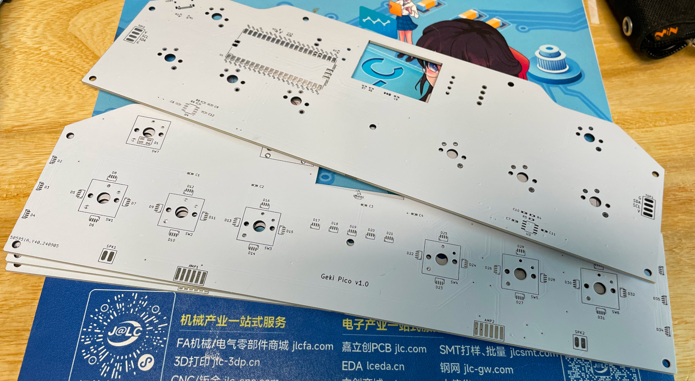
* 1x Rasberry Pico Pi Pico or pin-to-pin compatible clones (U1).  
  https://www.raspberrypi.com/products/raspberry-pi-pico
* 1x USB Type-C socket (918-418K2023S40001 or KH-TYPE-C-16P)
* 35x WS2812B-4020 side-facing RGB LEDs (D2-D36). Be careful with the orientation when soldering: D2 to D4 and D34 to D36 should be facing sideways, while the others should be facing up.  
  https://www.lcsc.com/product-detail/Light-Emitting-Diodes-LED_Worldsemi-WS2812B-4020_C965557.html
* 2x WS2812B-3528 RGB LEDs (D1, D37).
* 2x 8002A audio mini amplifier board (AMP1, AMP2), or you can use discrete components following the schematics (R4, R5, R8, R9, C9 ~ 12).  
  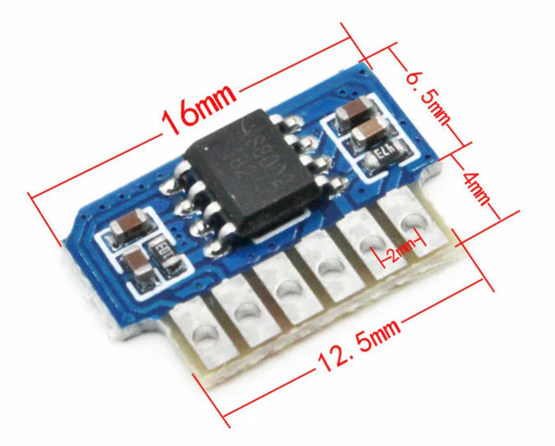  
  https://www.nz-electronics.co.nz/products/4pcs-one-sell-3v-5v-supply-voltage-3w-8002-audio-player-power-amplifier-module-board-pcb-mono  
  https://www.ebay.com.au/itm/225481264605

* 4x VL53L0x ToF sensors (two sensors on each side), get the optical covers too.  
  https://kuriosity.sg/products/time-of-flight-tof-distance-sensor-vl53l0x-200cm-with-optical-cover  
  https://www.smart-prototyping.com/VL53L0X-ToF-Distance-Sensor  
  You can also use 2x VL53L0x or VL53L1x, meaning each side only has one sensor. The performance is slightly worse.  
  https://www.amazon.com/Soaying-VL53L1X-Distance-Measurement-Extension/dp/B0CTHC43SV

* 2x Small speakers no larger than 20mm\*20mm\*5mm, 8ohm or close, (SPK1, SPK2), you can even harvest similar sized ones from old broken toys.  
  Try search on Google with keywords: "smd speaker 1540"

* 1x SS49E linear Hall sensor (U5).  
  https://mou.sr/4gDuQKu  
  https://www.digikey.com/short/fmm54dzq

* 1x Small 3V to 5V DC-DC step up or up-down converter (U6). Make sure its output is 5V and input range covers 3.3V. If the one you get has different pinout, you need to hand wire it.  
  https://www.dfrobot.com/product-1766.html  
  Alternatively, on PCB version v1.3 or later, there's an option for discrete components to replace the DC-DC module. You need an HT7750A in SOT23-5 (SOT25) package, a 22uH or 33uH inductor no larger than 5020, a Schottky diode (SS14, SS24, SS34, etc), and 2x 22uF 1206 capacitors.

* 8x 0603 0.1uF (0.1~1uF all fine) capacitors (C1 to C8), OPTIONAL but strongly recommended.
* 2x 0603 5.1kohm resistors (R1, R2) for the USB.
* 1x 0603 10ohm resistor, (1-20ohm all work fine) (R3).
* 1x 0603 10kohm resistor (R6).
* 1x 0603 20kohm resistor (R7).

* 8x Kailh Choc v1 or v2 switches (2 of them must be Choc v1). Choose linear ones, such as "Red Pro" or the latest Lofree branded Ghost.  
  

* 1x PN532 Module (the Red Square board version, cheap clones work too). It's optional, if you want a built-in card reader, then you need it.    
  https://www.elechouse.com/product/pn532-nfc-rfid-module-v4/

* If you're using 8002A boards, leave R4, R5, R8, R9, C9 ~ 12, U3, U4 empty.
* Leave U2 empty, it only provides placebo effect for better ADC reference voltage.

* This is how it looks after soldering.  
  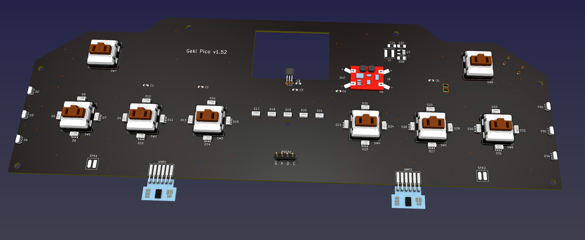  
  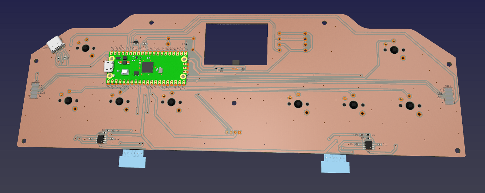
* Becareful of 2 pin holes. It's a common oversight to either forget to solder them or to leave air bubbles during the process. To avoid this, solder slowly from one side of the hole, using minimal solder wire and a generous amount of flux.  
  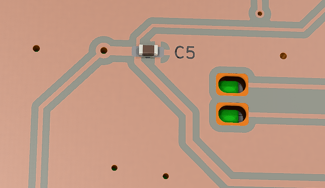

### 3D Printing
* Printing parameters  
  * PLA or PETG.
  * Layer height: 0.2mm
  * Support: Yes, always.

#### Lever Parts
* Lever Base: `Production\3DPrint\geki_pico_lever_base.stl`, white.
* Lever Rotator: `Production\3DPrint\geki_pico_lever_rotator_*mm.stl`, white, choose the one that matches your magnet diameter.
* 2x Lever Fixer: `Production\3DPrint\geki_pico_lever_fixer.stl`, white.
* Lever Handle: `Production\3DPrint\geki_pico_lever_handle.stl`, red.

#### Housing Parts
You need to rotate 135 degrees on Z axis to fit the bed.

* Housing Bottom: `Production\3DPrint\geki_pico_bottom.stl`, I chose sakura pink, what's your choice?
* Housing Support: `Production\3DPrint\geki_pico_support_*.stl`, semi-transparent. Choose the one that matches your ToF sensor configuration.
* Housing Top: `Production\3DPrint\geki_pico_top.*`, white. If you have multi-color printing equipment and skill, use the 3mf one (button outlines and logo are black).

#### Button Caps
* 6x Main Button Cap: `Production\3DPrint\geki_pico_button_main_choc_*.stl`, white, print up-side down so you get nice button surface and stem. Choc v1 and v2 are different, choose the right one.
* 2x Aux Button Cap: `Production\3DPrint\geki_pico_button_aux.stl`, semi-transparent, print up-side down.

### Lever
* Required components
  * PTFE or UHMW Film Tape, >=10mm wide, >=0.3mm (0.5mm is best) thick, one-side adhesive.  
    https://www.3m.com/3M/en_US/p/d/b40072069/
  * 2x MR117ZZ bearings (7mm inner diameter, 11mm outer diameter, 3mm thickness), go with cheap ones, they work just as great.  
    https://www.amazon.com/s?k=mr117zz
  * 1x Double-ended stud screws, M4 thread, 80mm length.  
    https://www.amazon.com/METALLIXITY-Double-Screws-Stainless-Threaded/dp/B0B7BX3CYH
  * 1x round magnet with **5mm** or **6mm** diameter, **2mm** to **3.5mm** tall, MUST be radially/diametrically magnetized (N-S poles on the curved side).  
    https://wargameportal.com/products/special-diametrically-magnetized-50pcs-5mm-x-2mm-3-16-x-1-16-disc-magnets?variant=49014932209942
  * 6x **M2*6mm regular screws** for resistance adjustment.
  * 4x **M2*16mm regular screws** for fixing the bearings.
  * Optional: Some damping grease.
* Assemble Steps
  1. Print out the parts.  
    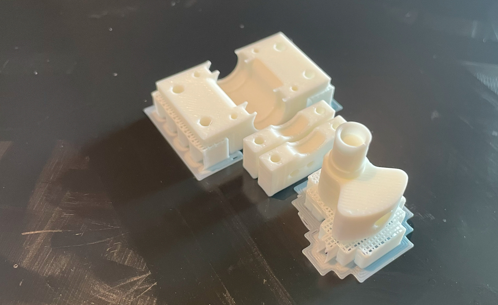 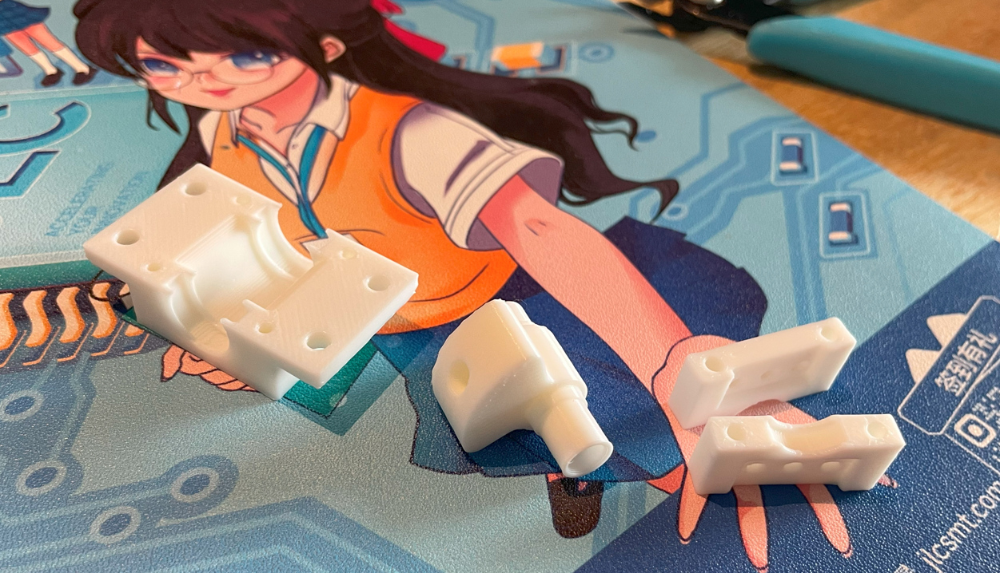 
  2. Stick PTFE/UHMW tape to the sliding surfaces of the fixer and the rotator. Then trim the tape to match the surface shape. If you have some damping grease (medium or medium-high stickiness), apply a tiny bit on the sliding surfaces. Turn the M2*6mm screws into the bearing fixers halfway, don’t and never tighten them.  
    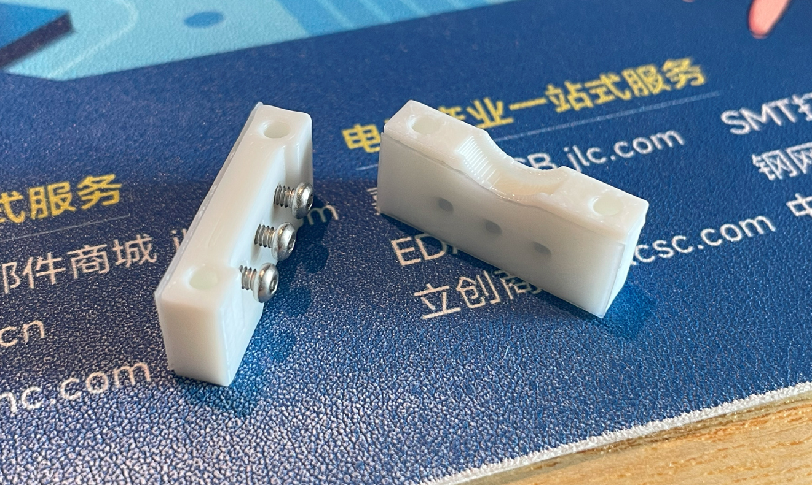 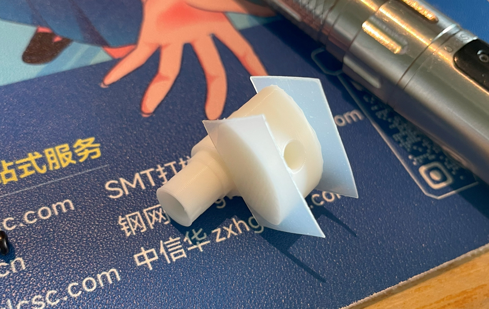 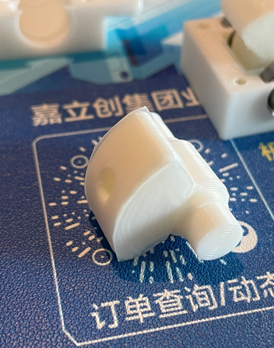
  3. Install the 2 bearings on both sides of the rotator and put it in the base, then use M2*16mm screws to fix the two bearing fixers on the base.  
     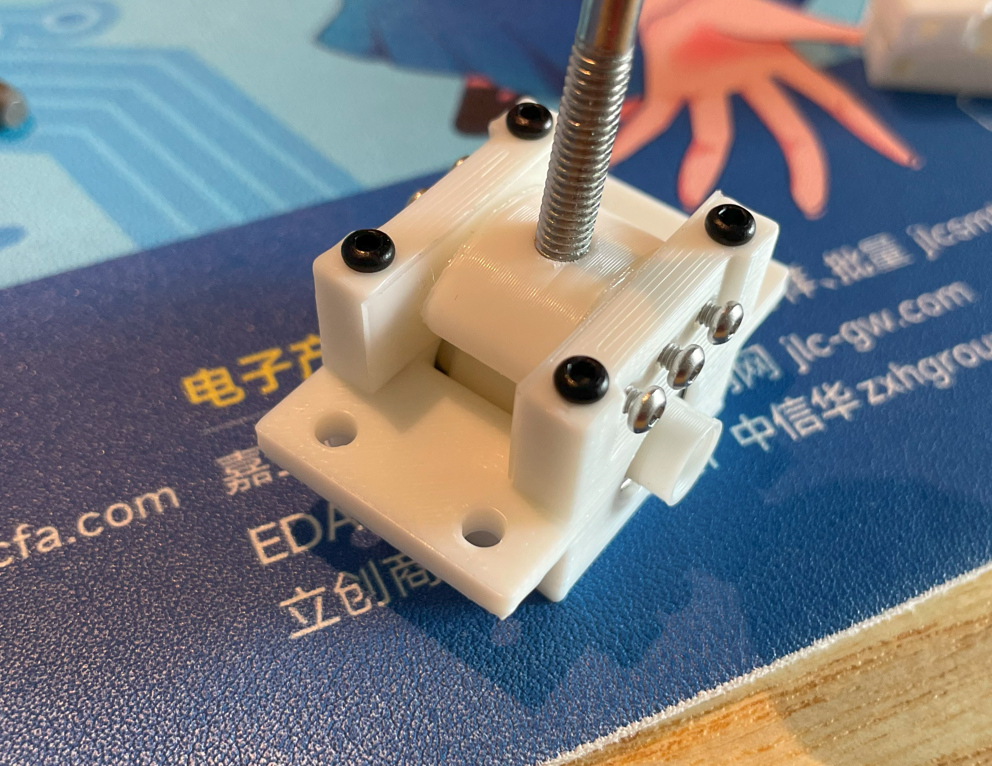
  4. Use some instant glue to stick the magnet to the bottom of the rotator. Make sure the poles are placed horizontally. A little trick is you connect several magnets together and draw a line to cross all the magnets, and then you know the poles.  
     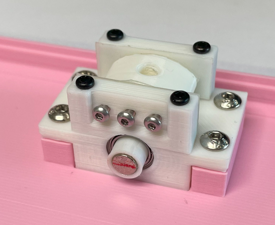
  5. Install the lever handle onto the double-ended stud screw, put aside. Later when the housing is ready we need to screw it into the lever rotator.  

### Assembly
* Other components needed
  * 4x **M3\*8mm regular screws** for fixing the lever to the bottom.
  * 8x **M3\*16mm regular screws** for the housing.
  * Some VHB double-sided tape to fix the speakers and the ToF sensors.
  * Some thin soft wires for the speakers and the ToF sensors.

* Steps
  1. Install the lever to the bottom part, using M3\*8mm screws.
  2. Wire (solder) the ToF sensors to the main PCB, each needs 4 wires.  
     If you're using an older PCB that only supports one sensor on each side, you can manually wire the secondary sensor. The secondary sensor uses the same SDA, SCL and GND pins as the primary sensor, but the VCC pin should be directly connected to the pins of the Pico, GP7 is for the right secondary sensor, GP9 is for the left secondary sensor.
  3. Use VHB tape to fix the ToF sensors on the ToF seats on the bottom part.
  4. Wire (solder) the speakers to the main PCB, each needs 2 wires.
  5. Use VHB tape to fix the speakers on the floor of the bottom part.
  6. Install the main PCB to the bottom part, no screws needed.
  7. Bend the hall-effect sensor (SS49E) so it stays on top of the lever magnets. Remember to leave a tiny gap so the rotator can move freely.  
    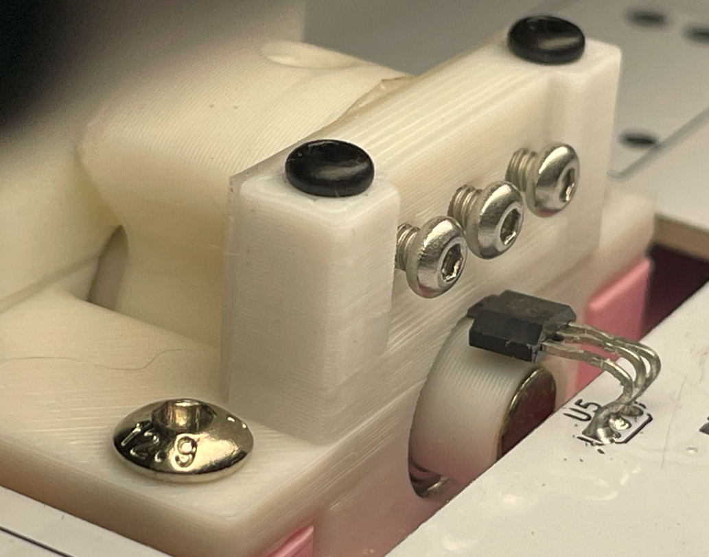 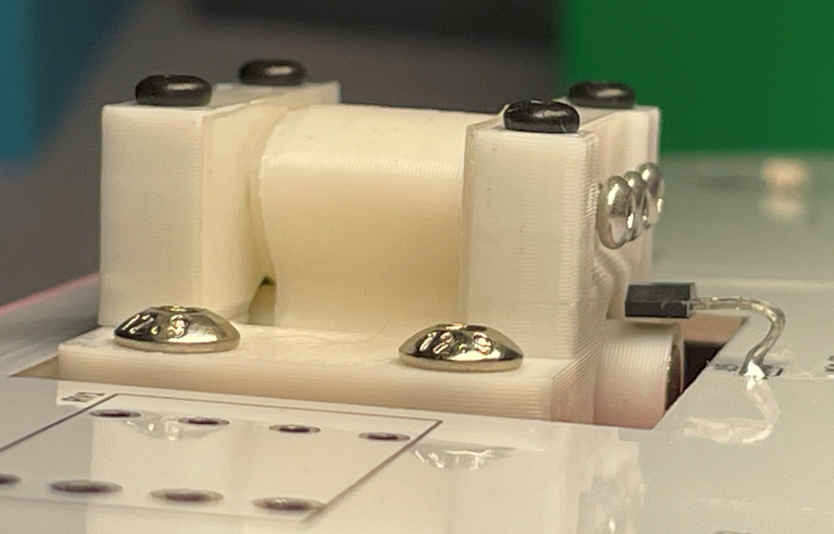
  8. Solder the PN532 module, 8002A modules to the main PCB if you haven't done it yet.
  9. Install the main button caps and the aux button caps onto the switches.
  10. Now it looks like this. Please note that in the picture it is the PCB v1. I've done some optimizations in the later version.  
    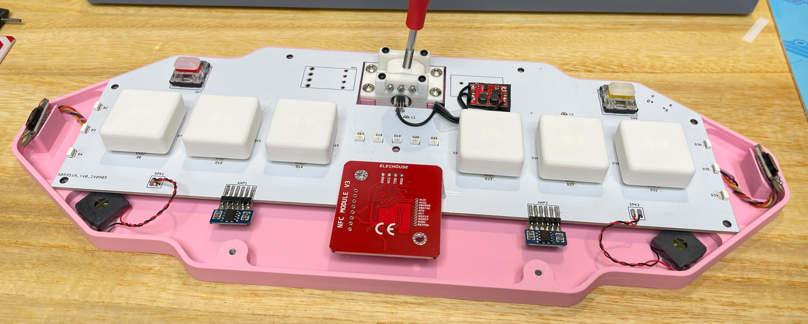
  11. Now it's the perfect chance to adjust the lever resistance. Slowly and gently turn the M2 screws to adjust the tension on the sliding surface. You may need to turn all the screws evenly.
  12. Put the support part on the bottom part, then put the top part on the support part.
  13. Align these parts and use M3\*20mm screws to fix them together. You may need to carefully adjust the position of the ToF sensors so the IR cover (or the tiny sensor chip) fit into the windows on the support part.
  14. Finally screw the lever handle into the lever rotator.  
    

### Firmware
* UF2 file is in `Production\Firmware` folder.
* For the new build, hold the BOOTSEL button while connect the USB to a PC, there will be a disk named "RPI-RP2" showed up. Drag the UF2 firmware binary file into it. That's it. There's a small hole at the bottom side of the Geki Pico, it is facing right to the BOOTSEL button.
* If it's already running Geki Pico firmware, you can either use "update" in command line or hold down at least 4 buttons while connecting to USB to enter update mode.
* To access the command line, you can use this Web Serial Terminal to connect to the USB serial port of the Geki Pico. (Note: "?" is for help)  
  https://googlechromelabs.github.io/serial-terminal/

### Usage
* You need to calibrate the lever by "lever calibrate" command after you flash the firmware.
* If you feel the lever direction is in correct, you can use "lever invert \<on|off\>" command to change it.
* Volume of sound feedback can be set by "volume \<0~255\>" command.
* ToF sensors have triggering zones, the purple zones are for the WAD, the orange zone is for SHIFT.  
  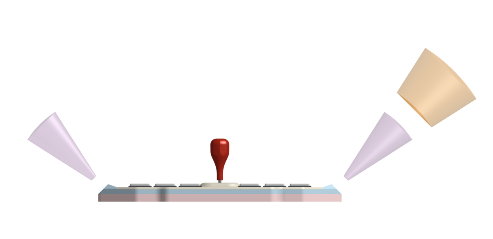 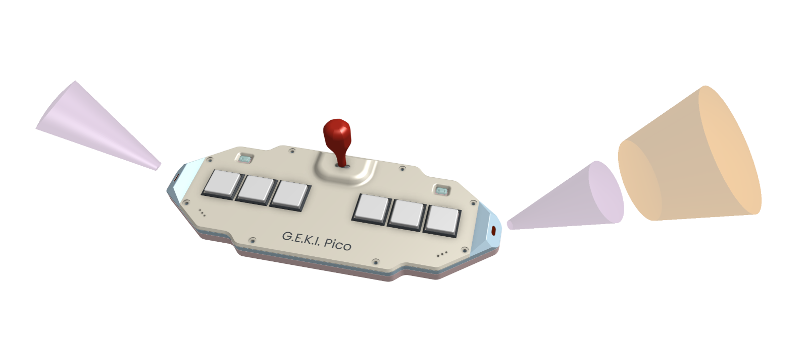
* To emulate IO4 TEST/SERVICE/COIN, you can put your hand in SHIFT zone. When you see the WAD lights flashing, the AUX buttons become TEST and SERVICE, and swinging the lever for "INSERT COINS".
* AIME is on a secondary COM port. You can set mode or toggle virtual AIC function.
* ToF mixing algorithms in dual sensor each side configuration.
  * `primary` and `secondary`: always use primary or secondary sensor, fallback to the other one if the chosen one has no reading, `strict` option means no fallback.
  * `max` and `min`: use the larger or smaller reading of the two sensors, `strict` option means if one sensor has no reading, result will be no reading.
  * `average`: use the average of the two sensors, `window` option means readings from both sensors must be within a certain range, otherwise result will be no reading. `window` set to 0 means no range check.
* You can set trigger window for left WAD, right WAD and shift by `tof trigger <left|right|shift> ...` command. The window is in millimeters. In is the window to trigger, out is the window to release.
* You can use `tof diagnose [on|off]` command to toggle diagnose mode. In diagnose mode, the ToF sensor will continuously print the raw distance data from all sensors. It's useful for diagnostics.

## CAD Source File
I'm using OnShape free subscription. It's powerful but it can't archive original designs to local, so I can only share the link here. STL/DXF/DWG files are exported from this online document.  
  https://cad.onshape.com/documents/eb38f3add988969c42b50060/w/86bcbeae8562f01c1a81c53e/e/feecb6f371a076c968584d3c