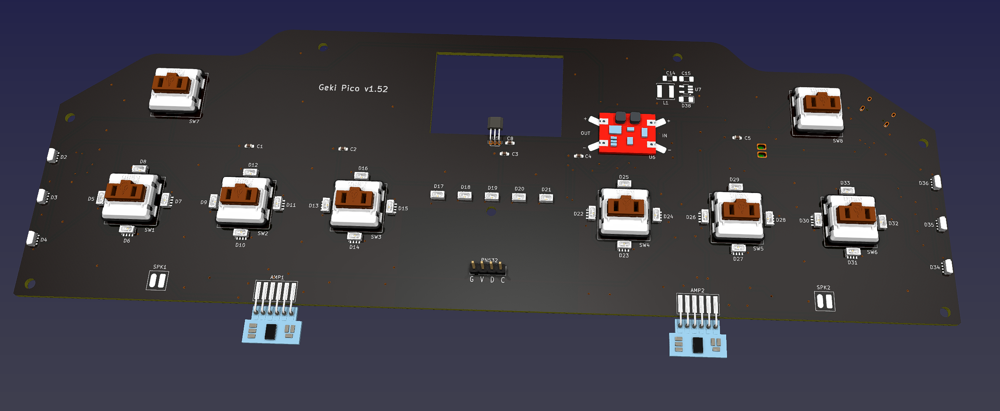
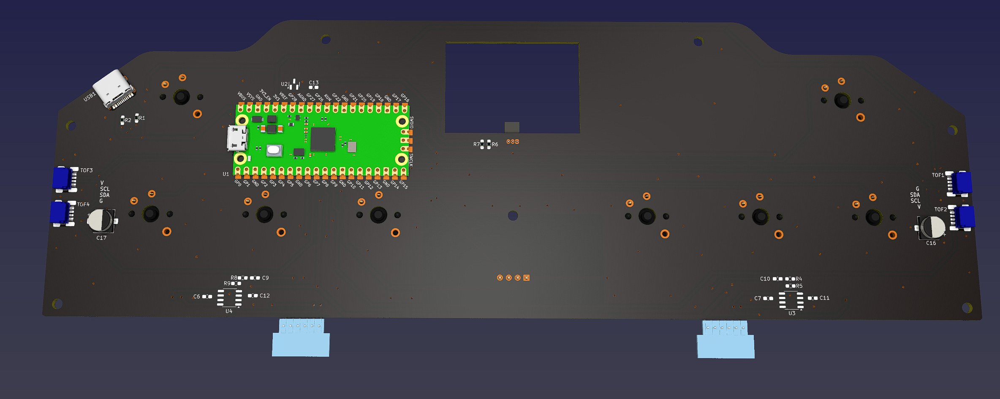

# Geki Pico - 音击风格的迷你控制器
[Click here for the English version of this guide.](README.md)

特性:
* 它很小，但尽量还原街机控制器的感觉。
* 相当丝滑的摇杆，阻尼可以调节。
* 带有声音反馈悬空虚拟侧面按钮。
* IO4 模拟。
* 内置 AIME 卡读卡器。
* 命令行配置。
* 所有源文件开放。

感谢许多尊敬的爱好者和公司将他们的工具或材料免费或开源（KiCad，OnShape，InkScape，Raspberry 相关工具, 嘉立创，等）。

特别感谢社区项目和开发者的帮助。
* Robin Grosset (https://github.com/rgrosset/pico-pwm-audio)
* GEEKiDoS (https://github.com/GEEKiDoS/ongeeki-firmware)
* Pololu (https://github.com/pololu/vl53l0x-arduino, https://github.com/pololu/vl53l1x-arduino)
* RP_Silicon_KiCad: https://github.com/HeadBoffin/RP_Silicon_KiCad
* Type-C: https://github.com/ai03-2725/Type-C.pretty

## 其他项目
你也可以查看我其他的酷炫项目。

           

* Popn Pico: https://github.com/whowechina/popn_pico
* IIDX Pico: https://github.com/whowechina/iidx_pico
* IIDX Teeny: https://github.com/whowechina/iidx_teeny
* Chu Pico: https://github.com/whowechina/chu_pico
* Mai Pico: https://github.com/whowechina/mai_pico
* Diva Pico: https://github.com/whowechina/diva_pico
* AIC Pico: https://github.com/whowechina/aic_pico
* Groove Pico: https://github.com/whowechina/groove_pico
* Geki Pico: https://github.com/whowechina/geki_pico
* Musec Pico: https://github.com/whowechina/musec_pico
* Ju Pico: https://github.com/whowechina/ju_pico

## **声明** ##
我在个人时间内制作了这个项目，没有任何经济利益或赞助。我将继续改进这个项目。我已尽我所能确保所有内容的准确性和功能性，但总有可能出现错误。如果你因使用这个开源项目而造成时间或金钱的损失，我不能负责。感谢你的理解。

## 关于许可证
它是 CC-NC 授权。所以你只能给自己和你的朋友 DIY，不能利用这个项目赚钱，比如收费的代做，出售整机等，连源作者都不敢提的抄袭或者稍微改改换个名字来打擦边球就更不可以了。注意团购和拼单订购原始元器件是合理的，非盈利的方式卖掉剩余的元器件也是可以接受的。

如果希望找我购买成品或者寻求商用授权，请联系我（Discord，QQ 群，闲鱼，微信群或者在 issue 区留下你的联系方式）。

## 我的 Discord 服务器邀请
https://discord.gg/M8f2PPQFEA

## 如何制作
### PCB 和相关器件
*  前往 JLCPCB 下单，使用最新的 `Production\PCB\geki_main_xxx.zip` 文件，选择常规 FR-4 板材，黑色或者白色均可，厚度为 **1.6mm**。  
  
* 1x 树莓派 Pico 或者引脚 1:1 全兼容的克隆版本。  
  https://www.raspberrypi.com/products/raspberry-pi-pico
* 1x USB Type-C 插座 (918-418K2023S40001 或 KH-TYPE-C-16P)
* 35x WS2812B-4020 侧向发光 RGB LED (D2-D36)。焊接的时候注意朝向，D2 ~ D4 和 D34 ~ D36 是朝侧面发光，其他的则都是朝上发光。  
  https://www.lcsc.com/product-detail/Light-Emitting-Diodes-LED_Worldsemi-WS2812B-4020_C965557.html
* 2x WS2812B-3528 RGB LED (D1, D37).
* 2x 8002A 迷你音频功放板 (AMP1, AMP2), 如果买不到现成的模块，你也可以对照电路图使用全分立元件 (R4, R5, R8, R9, C9 ~ 12)。  
    
  https://www.nz-electronics.co.nz/products/4pcs-one-sell-3v-5v-supply-voltage-3w-8002-audio-player-power-amplifier-module-board-pcb-mono  
  https://www.ebay.com.au/itm/225481264605

* 4x VL53L0x ToF 距离传感器（左右每边两个）, 把光学盖片买上。  
  https://kuriosity.sg/products/time-of-flight-tof-distance-sensor-vl53l0x-200cm-with-optical-cover  
  https://www.smart-prototyping.com/VL53L0X-ToF-Distance-Sensor  
  你也可以只用 2x VL53L0x 或者 VL53L1x，也就是每边各一个，这样稳定性稍弱。  
  https://www.amazon.com/Soaying-VL53L1X-Distance-Measurement-Extension/dp/B0CTHC43SV

* 2x 小扬声器，不要大于 20mm\*20mm\*5mm, 8ohm 或者相近的阻抗, (SPK1, SPK2), 买不到的话也可以从旧的电子玩具里拆。  
  可以在搜索引擎里试试搜索 “贴片 扬声器 1540”。

* 1x SS49E 线性霍尔传感器 (U5).  
  https://mou.sr/4gDuQKu  
  https://www.digikey.com/short/fmm54dzq

* 1x 迷你的 3V 到 5V DCDC 转换器，升压或者升降压的都可以 (U6)。注意输出一定要 5V，输入电压范围要能够覆盖 3.3V。如果你买到的模块引脚不对，你需要手工飞线。  
  https://www.dfrobot.com/product-1766.html  
  在 PCB v1.3 或者更新版本上，你可以选择使用离散元件替代 DC-DC 模块。你需要一个 SOT23-5 (SOT25) 封装的 HT7750A, 一个 22uH 或者 33uH 的电感，一个肖特基二极管 (SS14, SS24, SS34 等)，和 2x 22uF 1206 电容。

* 8x 0603 0.1uF (0.1~1uF 都可以) 电容 (C1 to C8), 可选，但是建议都焊上。
* 2x 0603 5.1kohm 电阻 (R1, R2) ，给 USB 口用的.
* 1x 0603 10ohm 电阻, (1-20ohm 都可以的) (R3).
* 1x 0603 10kohm 电阻 (R6).
* 1x 0603 20kohm 电阻 (R7).

* 8x 凯华巧克力 v1 或者 v2 矮键轴（其中 2 个必须是 v1）。记得选线性轴，比如 "Red Pro" 或者最新的洛斐定制的幽灵轴。  
  

* 1x PN532 NFC 模块 (红色大方块那个，便宜的克隆版本也很好用)。可选，如果你希望内置读卡器，那就要用到。  
  https://www.elechouse.com/product/pn532-nfc-rfid-module-v4/

* 如果你使用 8002A 的成品模块板子，那么 R4, R5, R8, R9, C9 ~ 12, U3, U4 都空着不焊。
* U2 空着就好，它用于稳定 ADC 参考电压，心理作用为主。

* 全部焊接完以后是这个样子，注意这是 v1 版本的 PCB，后续版本有一些优化。  
    
  

* 小心这两个小焊接孔，一般容易忘记焊接它们，或者在焊接过程中留下气泡。为了避免这种情况，从孔的一侧开始慢慢焊接，使用很少的焊丝和较多的焊剂。  
  

### 3D Printing
* 打印参数
  * PLA, PETG 都可以
  * 层高：0.2 毫米
  * 支撑：始终需要

#### 摇杆部分
* 摇杆底座: `Production\3DPrint\geki_pico_lever_base.stl`, 白色。
* 摇杆转轴: `Production\3DPrint\geki_pico_lever_rotator_*mm.stl`, 白色，根据你的磁铁直径选择合适的文件。
* 2x 轴承固定器: `Production\3DPrint\geki_pico_lever_fixer.stl`, 白色。
* 摇杆手柄: `Production\3DPrint\geki_pico_lever_handle.stl`, 红色。

#### 外壳部分
你需要在 Z 轴上旋转 135 度来适应热床。

* 外壳底部: `Production\3DPrint\geki_pico_bottom.stl`, 我用了樱花粉，你选什么颜色？
* 外壳支撑: `Production\3DPrint\geki_pico_support_*.stl`, 半透明，选择匹配你的 ToF 配置的那个。
* 外壳上部: `Production\3DPrint\geki_pico_top.*`, 白色。如果你有多色打印的设备和技巧，那用 3mf 后缀那个，按钮框和 Logo 是黑色的。

#### 按钮帽
* 6x 主按钮帽: `Production\3DPrint\geki_pico_button_main_choc_*.stl`, 白色，要上下颠倒打印，记得根据巧克力矮轴的 v1 或者 v2 版本选择正确的文件。
* 2x 辅助按钮帽: `Production\3DPrint\geki_pico_button_aux.stl`, 半透明，也是上下颠倒打印。

### 摇杆
* 需要的零件
  * PTFE 或者 UHMW 胶带, >=10mm 宽度, >=0.3mm (0.5mm 最好) 厚度, 单面自粘。  
    https://www.3m.com/3M/en_US/p/d/b40072069/
  * 2x MR117ZZ 轴承 (7mm 内径, 11mm 外径, 3mm 厚度)，买便宜的就行，一样好用。  
    https://www.amazon.com/s?k=mr117zz
  * 1x 双头螺栓，M4 螺纹，80mm 总长度。  
    https://www.amazon.com/METALLIXITY-Double-Screws-Stainless-Threaded/dp/B0B7BX3CYH
  * 1x 圆形小磁铁，直径 **5mm** 或者 **6mm**，厚度 **2mm** 到 **3.5mm**，必须是径向充磁的，也就是磁铁两极是在圆弧面上。  
    https://wargameportal.com/products/special-diametrically-magnetized-50pcs-5mm-x-2mm-3-16-x-1-16-disc-magnets?variant=49014932209942
  * 6x **M2*6mm 螺丝** 用于阻尼调整。
  * 4x **M2*16mm 螺丝** 用于固定轴承。
  * 可选: 阻尼脂。

* 组装过程
  1. 打印相关的零件  
      
  2. 把 PTFE/UHMW 胶带贴在摇杆和轴的滑动表面上，然后大致修剪成相应的形状。如果你有中或中高粘度的阻尼脂，可以在滑动表面涂一丁点。然后把 M2*6mm 螺丝半拧入轴承固定器，注意不要拧紧。  
      
  3. 把 2 个轴承固定器固定在底座上，然后用 M2*16mm 螺丝固定轴承。  
     
  4. 用 502 等快干胶把磁铁粘到旋转轴的底部。注意磁铁的极性朝向要尽量水平。你可以先把几个磁铁连在一起，然后画一条线穿过所有的磁铁，这样你就知道极性方向了。  
     
  5. 把摇杆的手柄安装到螺栓上，先放到一边，后面等外壳都装好后再拧到轴上。  

### 组装
* 其他需要的零件
  * 4x **M3\*8mm 螺丝** 用来把摇杆总成装到底部。
  * 8x **M3\*16mm 螺丝** 用来固定外壳。
  * 3M VHB 或者类似的神奇双面胶用来固定 ToF 传感器和扬声器。
  * 一些细软的电线，用来连接 ToF 传感器和扬声器。

* 步骤
  1. 用 M3\*8mm 螺丝把摇杆总成固定到底部。
  2. 把 ToF 传感器焊接到主 PCB 上，每个需要 4 根线。  
     如果你用的是旧版本 PCB，它很可能只支持每边一个传感器，这时候你需要手动接线。`次 ToF` 使用和 `主 ToF` 使用相同的 SDA, SCL 和 GND 引脚，但 VCC 引脚需要直接从 Pico 上去接，右边的 `次 ToF` 的 VCC 接 GP7，左边的 `次 ToF` 的 VCC 接 GP9。
  3. 用 VHB 胶带把 ToF 传感器固定到底部的两侧座位上。
  4. 把扬声器焊接到主 PCB 上，每个需要 2 根线。
  5. 用 VHB 胶带把扬声器固定到底部的地板上。
  6. 把 PCB 安装到底部上，不需要螺丝。
  7. 把 PCB 上的霍尔传感器 (SS49E) 弯曲到摇杆磁铁的上方。记得留一点间隙让轴能自由移动。  
     
  8. 如果你还没有焊接 PN532 模块，8002A 模块到主 PCB 上，现在就该焊上了。
  9. 把主按钮帽和辅助按钮帽安装到键轴上。
  10. 现在看起来是这样的。请注意图片中是 PCB v1 版本，后续版本有一些优化。  
    
  11. 现在是调整摇杆阻力的最佳时机。慢慢小心地转动 M2 螺丝来调整滑动表面的张力，记得要均匀地调整所有相关螺丝。
  12. 把支撑部分放到底部上，然后把上部放到支撑部分上。
  13. 外壳对齐后，用 M3\*20mm 螺丝把它们固定在一起。注意要小心地调整 ToF 传感器的位置，让 IR 盖片（或者微小的传感器）能够完全进入支撑部分上的窗口。
  14. 最后把带手柄的摇杆拧到轴上。  
    

### 固件
* UF2 文件在 `Production\Firmware` 文件夹下。
* 全新烧录的话，按住 Pico Pi 的 BOOTSEL 按钮，然后连接 USB 到 PC，会出现一个名为 "RPI-RP2" 的磁盘，将 UF2 固件二进制文件拖入即可。Geki Pico 的底部有一个小孔，它正对着 BOOTSEL 按钮。
* 如果已经烧录了 Geki Pico 固件，后续你可以在命令行使用 "update" 命令进行更新，或者按住至少 4 个按钮后连接 USB 进入更新模式。
* 要访问命令行，你可以使用 Web 串口终端工具来连接到 Geki Pico 提供的 USB 串口。（提醒："?" 命令可以查看帮助）  
  https://googlechromelabs.github.io/serial-terminal/

### 使用
* 烧录固件后，需要使用 "lever calibrate" 命令来校准摇杆。
* 如果你觉得摇杆方向不对，可以使用 "lever invert \<on|off\>" 命令来调整。
* 声音反馈的音量可以用 "volume \<0~255\>" 命令来调整。
* ToF 传感器有不同的触发区域，图中紫色区域用来触发侧面按钮，橙色的区域用作 SHIFT。  
   
* 为了模拟 IO4 的 TEST/SERVICE/COIN 这些按钮和功能，你可以把手放到 SHIFT 区域，当你看到控制器两侧指示灯闪烁的时候，两个辅助按钮就变为了 TEST 和 SERVICE，摇动摇杆则是“投币”。
* AIME 在第二个串口端口，你可以设置工作模式或者开关虚拟 AIC 功能。
* 每边两个 ToF 情况下的混合算法。
  * `primary` 和 `secondary`: 总是使用主 ToF 或者次 ToF，如果选择的那个没有读数，就会使用另一个，`strict` 选项表示即使没有读数也不允许使用另一个。
  * `max` 和 `min`: 使用两个传感器中的较大或较小读数，`strict` 选项表示如果一个传感器没有读数，结果将是没有读数。
  * `average`: 使用两个传感器的平均值，`window` 选项表示两个传感器的读数必须在一定范围内，否则结果将是没有读数。当 `window` 为 0 表示不比对范围。
* 你可以使用 `tof trigger <left|right|shift> ...` 命令来设置左右 ToF 和 SHIFT 的触发窗口。窗口单位是毫米。In 是触发窗口，Out 是释放窗口。
* 你可以使用 `tof diagnose [on|off]` 命令来切换诊断模式。在诊断模式下，ToF 传感器将持续打印所有传感器的原始距离数据。方便调试。

## CAD Source File
我使用的是 OnShape 的免费订阅。它很强大，但是它不能将原始设计存档到本地，所以我只能在这里分享链接。STL/DXF/DWG 文件是从这个在线文档导出的。    
  https://cad.onshape.com/documents/eb38f3add988969c42b50060/w/86bcbeae8562f01c1a81c53e/e/feecb6f371a076c968584d3c
